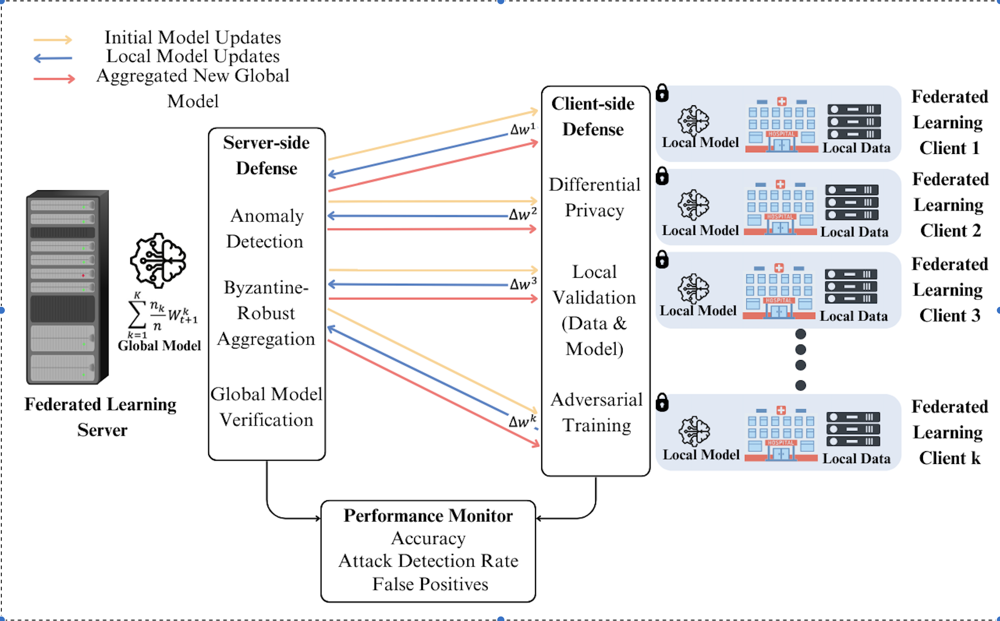

# Liver Cirrhosis Stage Predictor using Secure Federated Learning

This repository contains an advanced implementation of a federated learning (FL) system for predicting liver cirrhosis stages (1, 2 or 3) using patient data distributed across multiple clients. The system incorporates privacy-preserving techniques, security defenses against adversarial attacks and comprehensive evaluation mechanisms to ensure robustness and scalability.




## Overview

Federated Learning enables collaborative model training across decentralized clients without sharing raw data, preserving privacy. This project extends traditional FL by integrating:
- **Differential Privacy**: Adds noise to gradients to protect individual data contributions.
- **Adversarial Training**: Enhances model robustness against malicious inputs.
- **Defense Mechanisms**: Detects and mitigates data poisoning, model poisoning, backdoor, and man-in-the-middle (MITM) attacks.
- **Performance Monitoring**: Tracks latency, scalability, and security metrics across training rounds.

The system trains a neural network (`CirrhosisPredictor`) to classify cirrhosis stages using simulated client datasets, with a focus on security, scalability, and accuracy.

## Project Structure

```
liver-cirrhosis-stage-predictor-fl/
├── src/
│   ├── data_preprocessing.py
│   ├── model.py               
│   ├── federated_learning.py  
│   ├── evaluation.py          
│   ├── clients_defense.py     
│   ├── server_defense.py      
│   ├── attack_simulation.py   
│   ├── encryption.py          
│   ├── performance.py         
│   ├── experiments.py         
│   └── main.py                
├── data/                      
├── results/
└── README.md
```

## Components

### 1. Data Preprocessing (`data_preprocessing.py`)
- Loads CSV data, removes NaN values, and encodes the target (`Stage`) as 0, 1, 2.
- Applies one-hot encoding to categorical features and standardizes numerical features.
- Splits data into training/testing sets and distributes it among clients.

### 2. Model Architecture (`model.py`)
- `CirrhosisPredictor`: A multi-layer perceptron with:
  - Layers: Input → 256 → 128 → 64 → 3 (output)
  - ReLU activations, 30% dropout for regularization, and softmax output.

### 3. Federated Learning (`federated_learning.py`)
- Implements FL with early stopping based on test accuracy.
- Integrates client-side training with differential privacy (DP) and adversarial training.
- Simulates attacks (data poisoning, model poisoning, backdoor, MITM) with a 20% probability per client.
- Uses `FederatedDefender` for secure aggregation and attack detection.

### 4. Client-Side Defenses (`clients_defense.py`)
- **Data Validation**: Checks for NaN values, outliers and label distribution anomalies.
- **Model Validation**: Ensures accuracy, loss, adversarial consistency and backdoor resistance.
- **Training**: Supports DP (gradient clipping/noise) and adversarial example generation (FGSM).

### 5. Server-Side Defenses (`server_defense.py`)
- `FederatedDefender`:
  - Detects malicious updates using robust Z-scores, variance and kurtosis.
  - Applies trimmed mean aggregation to mitigate outliers.
  - Verifies global model performance and rolls back if degraded.

### 6. Attack Simulation (`attack_simulation.py`)
- Simulates:
  - **Data Poisoning**: Flips labels for 30% of data.
  - **Model Poisoning**: Adds noise to model parameters.
  - **Backdoor**: Inserts triggers to misclassify to a target label.
  - **MITM**: Tampers with encrypted updates.

### 7. Encryption Simulation (`encryption.py`)
- Simulates encryption/decryption by adding/removing noise to model parameters.

### 8. Evaluation (`evaluation.py`)
- Computes accuracy, precision, recall and F1-score per class.
- Generates formatted performance reports.

### 9. Performance Monitoring (`performance.py`)
- Tracks aggregation/validation latency, round times and scalability metrics.
- Reports security metrics (e.g., detection rate, false positives) and attack counts.

### 10. Experiments (`experiments.py`)
- **Federated Experiments**: Runs FL for multiple rounds, generating ROC curves, confusion matrices and latency reports.
- **Scalability Experiments**: Tests performance with varying client counts.
- **Accuracy Experiments**: Evaluates accuracy vs. client count and sample size.

### 11. Main Execution (`main.py`)
- Orchestrates data loading, preprocessing and experiment execution.

## Getting Started

### Prerequisites
- Python 3.8+
- PyTorch 1.8+
- Dependencies: `pandas`, `numpy`, `scikit-learn`, `matplotlib`, `seaborn`

### Installation

1. Clone this repository:
```bash
git clone https://github.com/fkayensu/liver-cirrhosis-stage-predictor-federated-learning.git
cd liver-cirrhosis-stage-predictor-federated-learning
```

2. Install dependencies:
```bash
pip install -r requirements.txt
```

### Data

Place your liver cirrhosis dataset (CSV format) in the `data/` directory. The dataset should contain patient features and a 'Stage' column with values 1, 2, 3.

### Running the Project

```bash
python src/main.py
```

## Federated Learning Process

1. Initialization: The server initializes a global CirrhosisPredictor model.
2. Rounds:
   - Clients train local models with DP and adversarial training.
   - Random attacks are simulated on 20% of clients.
   - Updates are encrypted, validated, and aggregated securely.
   - The global model is evaluated and updated with early stopping.
3. Output: Metrics, plots, and reports are saved in results/.

## Results

- Metrics: Accuracy, precision, recall, F1-scores, latency, and attack detection rates.
- Visualizations: ROC curves, confusion matrices, accuracy trends, and scalability plots.
- Directory: results/ (e.g., attack_detection_roc_run_1.png, performance_metrics.png).

## Privacy and Security

- Privacy: Data stays local; DP adds noise to updates.
- Security: Defenses detect and mitigate attacks, with rollback for compromised models.
- Encryption: Simulated to protect model updates.

## Acknowledgments

- The dataset used in this project is sourced from [kaggle](https://www.kaggle.com/datasets/aadarshvelu/liver-cirrhosis-stage-classification/data).